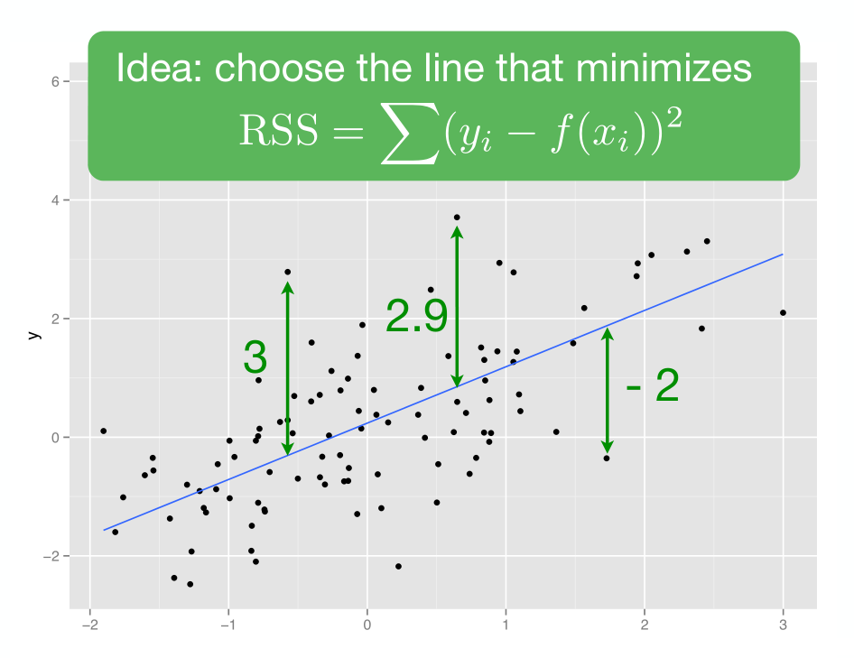
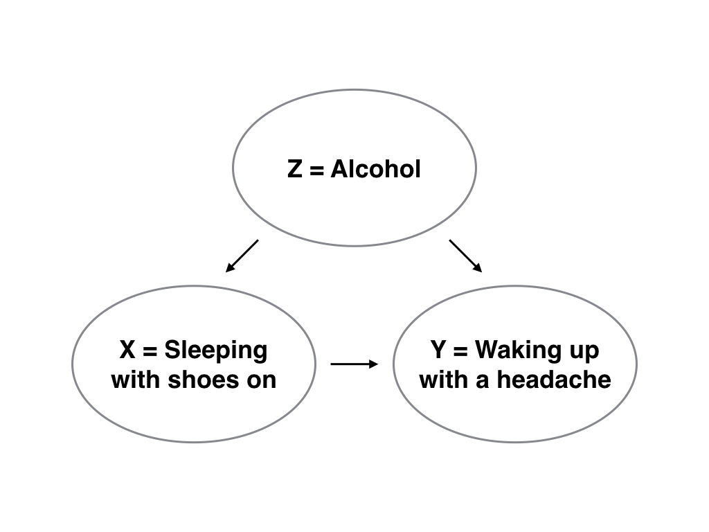

# Basic Regression

## Data Modeling

### The Fundamental Premise of Data Modeling

* An *outcome variable* $y$, a.k.a. *dependent variable* or response variable
* An *explanatory/predictor variable* $x$, a.k.a. an *independent variable* or *covariate*
* $y$ "as a function" of the explanatory/predictor variable $x$
   
### Purposes of Data Modeling

1. **Modeling for Explanation**
  - Explicitly describe and quantify the relationship between the outcome variable $y$ and a set of explanatory variables $x$
  - Determine the significance of any relationships
  - Have measures summarizing the relationships
  - Possibly identify any *causal* relationships between the variables
1. **Modeling for Prediction**
  - Predict an outcome variable $y$ based on the information contained in a set of predictor variables $x$ 
  - One doesn't care so much about understanding how all the variables relate and interact with one another

### Example of Explanation and Prediction Modeling

- An outcome variable $y$ of whether patients develop lung cancer 
- A set of risk factors $x$: smoking habits, age, socioeconomic status
- Modeling for explanation: describing and quantifying the effects of the different risk factors
  - Possibly to design an intervention to reduce lung cancer incidence in a population, such as targeting smokers of a specific age group with advertising for smoking cessation programs
- Modeling for prediction: make good predictions of which people will contract lung cancer

### What we focus on 

- Modeling for explanation 
- Linear regression: the relationship between $y$ and $x$ is assumed to be linear

### Needed packages

```{r, eval=FALSE}
library(tidyverse)
library(moderndive)
library(skimr)
library(gapminder)
# Packages needed internally 
library(patchwork)
library(kableExtra)
library(knitr)
library(IRdisplay)
library(mvtnorm)
library(broom)
```

## One numerical explanatory variable

### Example of instructor evaluation score

- What factors explain differences in instructor teaching evaluation scores?
  - Researchers at UT Austin tried to answer the question
- Here we investigate the differences in instructor teaching scores as a function of the instructor's "beauty" score
  - ... Instructors with higher "beauty" scores also have higher teaching evaluations? 
  - ... Instructors with higher "beauty" scores tend to have lower teaching evaluations? 
  - ... There is no relationship between "beauty" score and teaching evaluations? 
- Modeling the relationship between teaching scores and "beauty" scores using *simple linear regression*
  - A numerical outcome variable $y$ (the instructor's teaching score) and
  - A single numerical explanatory variable $x$ (the instructor's "beauty" score)

### Exploratory data analysis (EDA) 

- Looking at the raw data values
- Computing summary statistics
- Creating data visualizations
   
#### Looking at the raw data values

```{r}
evals_bty <- evals %>%
  select(ID, score, bty_avg, age)
glimpse(evals_bty)
```

- The same instructor appear more than once in the data (multiple courses in a year)
- `ID`: an identification variable
- `score`: a numerical variable of the course instructor's average teaching score
  - 1 are lowest and 5 are highest
  - This is the outcome variable $y$ of interest
- `bty_avg`: a numerical variable of the course instructor's average "beauty" score, where the average is computed from a separate panel of six students
  - "Beauty" scores of 1 are lowest and 10 are highest
  - This is the explanatory variable $x$ of interest
- `age`: a numerical variable of the course instructor's age

```{r, eval=FALSE}
evals_bty %>%
    sample_n(size = 5) %>%
    kable(digits = 3,
          caption = "A random sample of 5 out of the 463 courses at UT Austin",
          booktabs = TRUE,
          linesep = "") %>%
    kable_styling(font_size = 16) %>% as.character %>% display_html 
```

#### Computing summary statistics

```{r}
evals_bty %>%
  summarize(mean_bty_avg = mean(bty_avg),
            mean_score = mean(score),
            median_bty_avg = median(bty_avg),
            median_score = median(score))
```

- A better way: using `skim()`

```{r eval=FALSE}
evals_bty %>% select(score, bty_avg) %>% skim()
```
- `missing`: the number of missing values
- `complete`: the number of non-missing or complete values
- `n`: the total number of values
- `mean`: the average
- `sd`: the standard deviation
- `p0`: the 0th percentile: the value at which 0% of observations are smaller than it (the *minimum* value)
- `p25`: the 25th percentile: the value at which 25% of observations are smaller than it (the *1st quartile*)
- `p50`: the 50th percentile: the value at which 50% of observations are smaller than it (the *2nd* quartile and more commonly called the *median*)
- `p75`: the 75th percentile: the value at which 75% of observations are smaller than it (the *3rd quartile*)
- `p100`: the 100th percentile: the value at which 100% of observations are smaller than it (the *maximum* value)

##### Correlation coefficient 

```{r correlation1, echo=FALSE, fig.cap="Nine different correlation coefficients.", fig.height=2.6, purl=FALSE}
correlation <- c(-0.9999, -0.9, -0.75, -0.3, 0, 0.3, 0.75, 0.9, 0.9999)
n_sim <- 100
values <- NULL
for (i in seq_along(correlation)) {
    rho <- correlation[i]
    sigma <- matrix(c(5, rho * sqrt(50), rho * sqrt(50), 10), 2, 2)
    sim <- rmvnorm(n = n_sim,
                   mean = c(20, 40),
                   sigma = sigma) %>%
    as.data.frame() %>%
    as_tibble() %>%
    mutate(correlation = round(rho, 2))
    values <- bind_rows(values, sim)
}

(corr_plot <- ggplot(data = values, mapping = aes(V1, V2)) +
    geom_point() +
    facet_wrap(~correlation, ncol = 3) +
    labs(x = "x", y = "y") +
    theme(axis.text.x = element_blank(),
          axis.text.y = element_blank(),
          axis.ticks = element_blank()))
```

- Using the `get_correlation()` in `moderndive`
  - Put the name of the outcome variable on the left-hand side of the `~` "tilde" sign, while putting the name of the explanatory variable on the right-hand side: standard R's *formula notation*

```{r}
evals_bty %>% 
    get_correlation(formula = score ~ bty_avg)
```

- An alternative way to compute correlation:

```{r, eval=FALSE}
evals_bty %>% 
    summarize(correlation = cor(score, bty_avg))
cor_bty <- evals_bty %>%
    summarize(correlation = cor(score, bty_avg)) %>%
    round(3) %>%
    pull()
```

#### Interesting

- [Guess the Correlation](http://guessthecorrelation.com)

#### Creating data visualizations

```{r numxplot1, echo=FALSE, fig.cap="Instructor evaluation scores at UT Austin.", fig.height=4.5, purl=FALSE}
# Define orange box
margin_x <- 0.15
margin_y <- 0.075
box <- tibble(x = c(7.83, 8.17, 8.17, 7.83, 7.83) + c(-1, 1, 1, -1, -1) * margin_x,
              y = c(4.6, 4.6, 5, 5, 4.6) + c(-1, -1, 1, 1, -1) * margin_y)

ggplot(evals_bty, 
       aes(x = bty_avg, y = score)) +
    geom_point() +
    labs(x = "Beauty Score",
         y = "Teaching Score",
         title = "Scatterplot of relationship of teaching and beauty scores") +
    geom_path(data = box, 
              aes(x = x, y = y), 
              col = "orange", size = 1)
```

- Most "beauty" scores lie between 2 and 8; most teaching scores lie between 3 and 5
- The relationship between teaching score and "beauty" score is "weakly positive" 
- The plot suffers from overplotting: fix  

```{r numxplot2, echo=FALSE, fig.cap="Instructor evaluation scores at UT Austin.", fig.height=4.2, purl=FALSE}
ggplot(evals_bty, 
    aes(x = bty_avg, y = score)) +
    geom_jitter() +
    labs(x = "Beauty Score", y = "Teaching Score",
         title = "(Jittered) Scatterplot of relationship of teaching and beauty scores") +
    geom_path(data = box, 
              aes(x = x, y = y), 
              col = "orange", size = 1)
```

## Linear regression modeling

- $$\widehat{y} = \beta_0 + \beta_1 \cdot x$$
- Method of ordinary least square



```{r numxplot3, fig.cap="Regression line.", message=FALSE}
ggplot(evals_bty,
       aes(x = bty_avg, y = score)) +
    geom_point() +
    labs(x = "Beauty Score", y = "Teaching Score",
         title = "Relationship between teaching and beauty scores") +  
    geom_smooth(method = "lm", se = FALSE)
```

- Fit the linear regression model using `lm()` and save it in `score_model`
- Get the regression table by applying `get_regression_table()` from `moderndive` to `score_model`

```{r, echo=FALSE, purl=FALSE}
score_model <- lm(score ~ bty_avg, data = evals_bty)
evals_line <- score_model %>%
    get_regression_table() %>%
    pull(estimate)

get_regression_table(score_model) %>%
    kable(digits = 3,
          caption = "Linear regression table",
          booktabs = TRUE,
          linesep = "") %>%
    kable_styling(font_size = 16) %>% as.character %>% display_html 
```

- The intercept $\beta_0$ and the slope $\beta_1$ for `bty_avg` in `estimate` column
- For every increase of 1 unit in `bty_avg`, there is an *associated* increase of *on average* $\beta_1$ units of `score`
- An *associated* increase is not necessarily a *causal* increase
  - The higher "beauty" scores may cause higher teaching scores for individuals from wealthier backgrounds tend to have stronger educational backgrounds and higher "beauty" scores 
  - "correlation is not necessarily causation"

### Learning Check

Fit a new simple linear regression using `lm(score ~ age, data = evals_bty)` where `age` is the new explanatory variable $x$. Get information about the "best-fitting" line from the regression table by applying the `get_regression_table()` function. How do the regression results match up with the results from your earlier exploratory data analysis?

```{r}
# Your Turn

```

## One categorical explanatory variable 

### Example of life expectancy

- Differences between continents: Are there significant differences in average life expectancy between the five continents: Africa, the Americas, Asia, Europe, and Oceania?
- Differences within continents: How does life expectancy vary within the five continents? 
  - Is the spread of life expectancy in Africa larger than the spread of life expectancy in Asia?

### Exploratory data analysis 

```{r, message=FALSE}
library(gapminder)
gapminder2007 <- gapminder %>%
    filter(year == 2007) %>%
    select(country, lifeExp, continent, gdpPercap)
```

- A numerical outcome variable $y$ (a country's life expectancy)
- A single categorical explanatory variable $x$ (the continent that the country is a part of)

#### Looking at the raw data values

```{r}
glimpse(gapminder2007)
```

- `country`: An identification variable of type character/text used to distinguish the 142 countries in the dataset
- `lifeExp`: A numerical variable of that country's life expectancy at birth 
  - This is the outcome variable $y$ of interest
- `continent`: A categorical variable with five levels
  - Here "levels" correspond to the possible categories: Africa, Asia, Americas, Europe, and Oceania
  - This is the explanatory variable $x$ of interest
- `gdpPercap`: A numerical variable of that country's GDP per capita in US inflation-adjusted dollars that we'll use as another outcome variable $y$ in the *Learning check*

```{r model2-data-preview, echo=FALSE, purl=FALSE}
gapminder2007 %>%
    sample_n(5) %>%
    kable(digits = 3,
          caption = "Random sample of 5 out of 142 countries",
          booktabs = TRUE,
          linesep = "") %>%
    kable_styling(font_size = 16) %>% as.character %>% display_html 
```

#### Computing summary statistics

```{r eval=FALSE}
gapminder2007 %>%
    select(lifeExp, continent) %>%
    skim()
```

- Why is the mean life expectancy lower than the median?

```{r lifeExp2007hist, echo=TRUE, fig.cap="Histogram of life expectancy in 2007.", fig.height=5.2}
ggplot(gapminder2007, aes(x = lifeExp)) +
    geom_histogram(binwidth = 5, color = "white") +
    labs(x = "Life expectancy", y = "Number of countries",
         title = "Histogram of distribution of worldwide life expectancies")
```

- The data is *left-skewed* (a.k.a. *negatively* skewed)

```{r catxplot0b, echo=FALSE, fig.cap="Life expectancy in 2007.", fig.height=4.3, purl=FALSE}
(faceted_life_exp <- ggplot(gapminder2007, 
                           aes(x = lifeExp)) +
    geom_histogram(binwidth = 5, color = "white") +
    labs(x = "Life expectancy", y = "Number of countries",
         title = "Histogram of distribution of worldwide life expectancies") +
    facet_wrap(~continent, nrow = 2))
```

#### Creating data visualizations

- An alternative method to visualize the distribution of a numerical variable split by a categorical variable is by a side-by-side boxplot
- Map `continent` to the $x$-axis and different life expectancies within each continent on the $y$-axis

```{r catxplot1, fig.cap="Life expectancy in 2007.", fig.height=3.4}
ggplot(gapminder2007, 
       aes(x = continent, y = lifeExp)) +
    geom_boxplot() +
    labs(x = "Continent", y = "Life expectancy",
         title = "Life expectancy by continent")
```

- Compute the median and mean life expectancy for each continent
  
```{r, eval=TRUE}
lifeExp_by_continent <- gapminder2007 %>%
    group_by(continent) %>%
    summarize(median = median(lifeExp), 
              mean = mean(lifeExp)) %>%
    kable(digits = 3,
          caption = "Life expectancy by continent",
          booktabs = TRUE,
          linesep = "") %>%
    kable_styling(font_size = 16) %>% as.character %>% display_html 
```

### Learning Check

Conduct a new exploratory data analysis with the same explanatory variable $x$ being `continent` but with `gdpPercap` as the new outcome variable $y$. What can you say about the differences in GDP per capita between continents based on this exploration?

```{r}
# Your Turn

```

### Linear regression

- Fit the linear regression model using the `lm(y ~ x, data)` function and save it in `lifeExp_model`
- Get the regression table by `get_regression_table()` from `moderndive` to `lifeExp_model`

```{r, echo=FALSE, purl=FALSE}
lifeExp_model <- lm(lifeExp ~ continent, data = gapminder2007)
get_regression_table(lifeExp_model) %>%
    kable(digits = 3,
          caption = "Linear regression table",
          booktabs = TRUE,
          linesep = "") %>%
    kable_styling(font_size = 16) %>% as.character %>% display_html 
```

- Why was Africa chosen as the "baseline for comparison" group?
  - Because it comes first alphabetically of the five continents
  - By default R arranges factors/categorical variables in alphanumeric order
  - One can change this baseline group by manipulating the variable `continent`'s factor "levels" using `forcats` 
- THE regression equation for single categorical variable $$
\begin{multline}
  \widehat{y} = \beta_0 + \beta_{\text{Amer}}\,\mathbb{1}_{\text{Amer}}(x) + \beta_{\text{Asia}}\,\mathbb{1}_{\text{Asia}}(x) + \beta_{\text{Euro}}\,\mathbb{1}_{\text{Euro}}(x) + \beta_{\text{Ocean}}\,\mathbb{1}_{\text{Ocean}}(x)
\end{multline}
$$

  - Here $$\mathbb{1}_{A}(x) = \begin{cases}
1 & \text{if } x \text{ is in } A \\
0 & \text{if otherwise}
\end{cases}
$$

### Learning Check

Fit a new linear regression using `lm(gdpPercap ~ continent, data = gapminder2007)` where `gdpPercap` is the new outcome variable $y$. Get information about the "best-fitting" line from the regression table by applying the `get_regression_table()` function. How do the regression results match up with the results from your previous exploratory data analysis?

```{r}

```

## Related topics

### Correlation is not necessarily causation

- "beauty" score is positively correlated with teaching `score` 
  - But we can't make any statements about "beauty" scores' direct causal effect on teaching `score` without more information
- A doctor finds that patients who slept with their shoes on tended to wake up more with headaches 
  - "Sleeping with shoes on causes headaches!"
  - If someone is sleeping with their shoes on, it's potentially because they are intoxicated from alcohol 
  - Higher levels of drinking leads to more hangovers and hence more headaches
  - The amount of alcohol consumption is known as a *confounding/lurking* variable
    
- Y is a *response* variable; "waking up with a headache"
- X is a *treatment* variable whose causal effect we are interested in; "sleeping with shoes on"
- Z is a *confounding* variable that affects both X and Y, thereby "confounding" their relationship; "alcohol"



### Interesting

- [Spurious Correlations](http://www.tylervigen.com/spurious-correlations)
