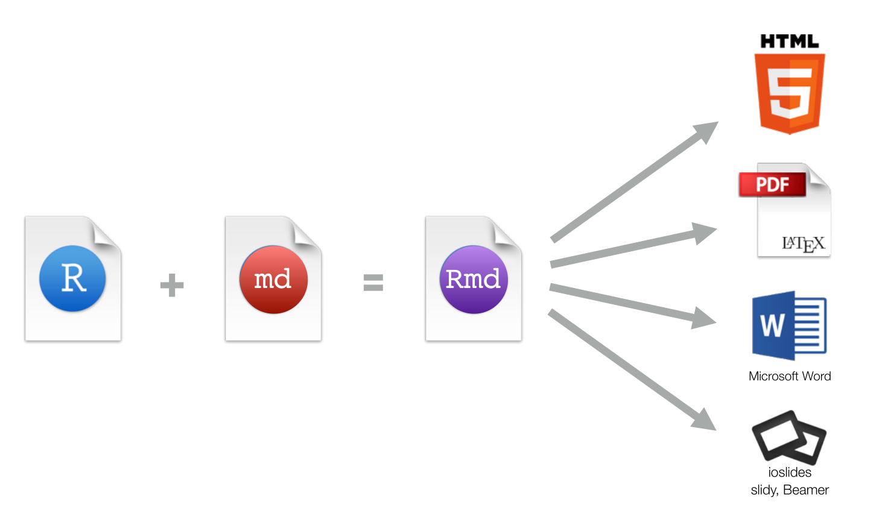

<!-- global setup -->
```{r setup, include=FALSE}
knitr::opts_chunk$set(echo = TRUE)
library(rmdformats)
```

<!-- 
###########################################################
# Markdown Syntax                                         #
# This style is personal; you don't need to follow.       #
###########################################################
-->

# RMarkdown
## Motivation

### HTML: THE Display Format of Browser: VERBOSE !

- [Example: GitHub Readme](https://github.com/chang-ye-tu/r)
- In HTML:
  
```
<html>
  <head>
    <style>body {
      color: black;
      }
    </style>
  </head>
  <body>
    <h1>資料科學與 R 語言</h1>
    <p>這裡是東吳大學 110 學年度第二學期「資料科學與 R 語言」的課程主頁。</p>
    <h2>評分標準</h2>
    <p>實際資料分析：繳交書面報告（Rmd / Rnw 檔案配合 knitr 生成 html / pdf / ipynb）三至五頁及上台展示（五分鐘）。 </p>
    <h2>授課內容</h2>
    <ul>
      <li>
        Base-R
        <ul>
          <li>First Encounter</li>
          <li>Operators</li>
          <li>Functions</li>
          <li>Vectors</li>
          <li>Common Tasks</li>
          <li>Programming </li>
        </ul>
      </li>
      <li>
        <p><code>tidyverse</code> </p>
        <ul>
          <li>Data Wrangling: <code>dplyr</code></li>
          <li>Data Visualization: <code>ggplot2</code></li>
          <li>Data Importing and Tidying: <code>readr</code>, <code>stringr</code>, <code>lubridate</code></li>
        </ul>
      </li>
      <li>
        <p>Selected Topics</p>
        <ul>
          <li>R Markdown, <code>LaTeX</code> </li>
          <li>Linear Regression &amp; Inference</li>
        </ul>
      </li>
    </ul>
    <h2>授課時程</h2>
    <table>
      <thead>
        <tr>
          <th>上課時間</th>
          <th>課程進度</th>
        </tr>
      </thead>
      <tbody>
        <tr>
          <td>2/25</td>
          <td>Preliminaries</td>
        </tr>
        <tr>
          <td>3/04</td>
          <td>Base-R: First Encounter</td>
        </tr>
        <tr>
          <td>3/11</td>
          <td>Base-R: Operators, Functions, Vectors</td>
        </tr>
        <tr>
          <td>3/14, 3/18</td>
          <td>Base-R: Vectors, Common Operations</td>
        </tr>
        <tr>
          <td>3/25</td>
          <td>Base-R: Programming</td>
        </tr>
        <tr>
          <td>3/28</td>
          <td>Base-R: Programming</td>
        </tr>
        <tr>
          <td>4/08</td>
          <td><code>tidyverse</code>: Data Wrangling: <code>dplyr</code></td>
        </tr>
        <tr>
          <td>4/11, 4/15</td>
          <td><code>tidyverse</code>: Data Wrangling: <code>dplyr</code></td>
        </tr>
        <tr>
          <td>4/22</td>
          <td><code>tidyverse</code>: Data Importing and Tidying: <code>readr</code>, <code>stringr</code>, <code>lubridate</code></td>
        </tr>
        <tr>
          <td>4/25, 4/29</td>
          <td><code>tidyverse</code>: Data Visualization: <code>ggplot2</code></td>
        </tr>
        <tr>
          <td>5/06</td>
          <td>Selected Topics: R Markdown, <code>LaTeX</code></td>
        </tr>
        <tr>
          <td>5/09, 5/13</td>
          <td>Selected Topics: Linear Regression &amp; Inference</td>
        </tr>
        <tr>
          <td>5/20</td>
          <td>Selected Topics: Linear Regression &amp; Inference</td>
        </tr>
        <tr>
          <td>5/23, 5/27</td>
          <td>Selected Topics: Linear Regression &amp; Inference</td>
        </tr>
        <tr>
          <td>6/06, 6/10</td>
          <td>Selected Topics: Linear Regression &amp; Inference</td>
        </tr>
      </tbody>
    </table>
    <p>原則上 5/20 該週確定題目與使用資料集，6/06 該週報告。</p>
    <h2>授課教師</h2>
    <p>杜昌燁 cwtu320313 @ googlemail.com</p>
  </body>
</html>
```
---

### Markdown: An Easy-to-Read and Easy-to-Write Plain Text Format

- Same doc in Markdown:

```
# 資料科學與 R 語言

這裡是東吳大學 110 學年度第二學期「資料科學與 R 語言」的課程主頁。

## 評分標準

實際資料分析：繳交書面報告（Rmd / Rnw 檔案配合 knitr 生成 html / pdf / ipynb）三至五頁及上台展示（五分鐘）。 

## 授課內容

* Base-R
  - First Encounter
  - Operators
  - Functions
  - Vectors
  - Common Tasks
  - Programming 
* `tidyverse` 
  - Data Wrangling: `dplyr`
  - Data Visualization: `ggplot2`
  - Data Importing and Tidying: `readr`, `stringr`, `lubridate`

* Selected Topics
  - R Markdown, `LaTeX` 
  - Linear Regression & Inference

## 授課時程

| 上課時間           | 課程進度                                       | 
|--------------------|------------------------------------------------|
| 	2/25         | Preliminaries                                  | 
|       3/04         | Base-R: First Encounter                        |
|       3/11         | Base-R: Operators, Functions, Vectors          |
| 3/14, 3/18         | Base-R: Vectors, Common Operations             | 
|       3/25         | Base-R: Programming                            |
| 3/28               | Base-R: Programming                            |
|       4/08         | `tidyverse`: Data Wrangling: `dplyr`           |
| 4/11, 4/15         | `tidyverse`: Data Wrangling: `dplyr`           |
|       4/22         | `tidyverse`: Data Importing and Tidying: `readr`, `stringr`, `lubridate`|
| 4/25, 4/29         | `tidyverse`: Data Visualization: `ggplot2`     |
|       5/06         | Selected Topics: R Markdown, `LaTeX`           |
| 5/09, 5/13         | Selected Topics: Linear Regression & Inference |
|       5/20         | Selected Topics: Linear Regression & Inference |
| 5/23, 5/27         | Selected Topics: Linear Regression & Inference |
| 6/06, 6/10         | Selected Topics: Linear Regression & Inference | 

原則上 5/20 該週確定題目與使用資料集，6/06 該週報告。

## 授課教師

杜昌燁 cwtu320313 @ googlemail.com
```

## R Markdown Capabilities

<center>
{width=80%}
</center>

# Markdown Syntax {#Syntax}

## Headers 
# Header 1 (Unnumbered) {.unnumbered}
## Header 2 {-}
### Header 3 {-}
#### Header 4 {-}
##### Header 5  {-}
###### Header 6  {-} 

## Available Themes
[R Markdown Theme Gallery](https://www.datadreaming.org/post/r-markdown-theme-gallery/)

## Enumeration: Without Number
* Plain text 
     + *italics* and _italics_ 
     + <em>italics </em>
          - **bold** and __bold__
* Color (with html style): <span style="color: green;"> This is green </span>.

## Enumeration: With Number 
1. superscript^2^ 
2. subscript~2~ 
    i) The Definitive R Markdown [User Manual](https://bookdown.org/yihui/rmarkdown/).
    iii) My homepage <https://chang-ye-tu.github.io/>  
        A. endash: --     
        B. emdash: ---     
        C. ellipsis: ...   
        D. ~~strikethrough~~

End a line with two spaces to start a new paragraph.


<!-- 
############################################################
# Code Blocks                                              #       
############################################################
-->
# Code Blocks 


## Code 
The most useful command is `str`, the most powerful command is `apply`


## Embedded Code (code inline)
Summation from 1 to 100 is `r sum(1:100)`: this is done in `R` using `sum(1:100)`。 


## code chunk (code listing)
```{r} 
paste("Hello", "World!") 
``` 


## code chunk (code listing with result only)
```{r eval=TRUE, echo=FALSE} 
paste("Hello", "World!") 
``` 

## code chunk (verbatim) 

```
# The Inverse of a Manually Entered Matrix
my.inverse <- function(n){
    cat("Computing the Inverse Matrices.\n")  
    cat("Please Enter", n, " by ", n, ":")
    m <- matrix(scan(), ncol=n, nrow=n)
    list(Mat=m, Mat.inverse=solve(m))
}

my.inverse(n=3)
```

<!-- 
############################################################
# Tables                                                   #       
############################################################
-->
# Tables 


## Hand-Crafted Tables 
| Right | Left | Default | Center |
|------:|:-----|---------|:------:|
| 12    | 12   |  12     | 12     |
| 123   | 123  | 123 | 123 |
| 1     | 1    | 1       | 1      |


## Data Frame (`data.frame`) Tables
```{r results = 'asis'}
head(airquality) # don't work in R Markdown
```

## knitr::kable Tables
```{r airquality, results = 'asis'}
mydata <- airquality[1:4,]
knitr::kable(mydata, caption = "Table with kable")
```

<!-- 
###########################################################
# Graphics                                                #
###########################################################
-->
# Graphics 

## ggplot2 Graphs (Centered)
```{r ggplot2, fig.align = "center"} 
library(tidyverse)
library(nycflights13)

df <- flights %>%
  group_by(dest) %>%
  summarize(count = n(),
            dist = mean(distance, na.rm = TRUE),
            delay = mean(arr_delay, na.rm = TRUE)) %>%
  filter(delay > 0, count > 20, dest != "HNL")

(p <- df %>%
  ggplot(mapping = aes(x = dist, y = delay)) +
    geom_point(aes(size = count), alpha = 1 / 3) +
    geom_smooth(se = FALSE))
```

## Images 
image: {width=30%}


## Images (Rendered with knitr)
```{r, out.width='25%', fig.align="center", fig.cap="R-Logo"}
knitr::include_graphics("https://www.r-project.org/Rlogo.png")
```

<!-- 
###########################################################
# Math Formulas                                           #
###########################################################
-->
# Math Formulas 


## Inline Math 
The Area of a Circle: $A = \pi\times r^{2}$，Average: $\bar{X}=\frac{\sum_{i=1}^n x_i}{n}$.


## Display Math (Unnumbered)
The Probability Density Function of the Normal Distribution ${\sf N}(\mu, \sigma)$ is
\[ 
f(x)=\frac{1}{\sqrt{2\pi}\sigma}e^{-\frac{(x-\mu)^2}{2\sigma^2}} 
\] 

## Display Math (Numbered)

The Pauli Matrices
\begin{equation}
\sigma_x = 
  \begin{pmatrix}
    0 & 1 \\
    1 & 0
  \end{pmatrix}, \qquad
\sigma_y = 
  \begin{pmatrix}
    0 & -i \\
    i & 0
  \end{pmatrix}, \qquad
\sigma_z = 
  \begin{pmatrix}
    1 & 0 \\
    0 & -1
  \end{pmatrix}.
  (\#eq:matrix)
\end{equation}

The Rogers-Ramanujan Identity
\begin{equation}
  1 +  \frac{q^2}{(1-q)}+\frac{q^6}{(1-q)(1-q^2)}+\cdots = \prod_{j=0}^{\infty}\frac{1}{(1-q^{5j+2})(1-q^{5j+3})},\qquad \text{for $|q|<1$}.
  (\#eq:roger)
\end{equation}


<!-- 
###########################################################
# Misc                                                    #
###########################################################
-->
# Misc 


Three or more consecutive (*) generate a horizontal line: 

****** 

Three or more consecutive (-) generate a page break: 

------


> block quote


This is a sentence with 2 blank rows below.
<br><br/><br><br/>
This is a sentence with 2 blank rows above.


Add a grey borderline (with html):
<hr style="border:1px solid gray"> </hr>


This is a paragraph needs footnote ^[Here is the footnote.]


<!-- 
###########################################################
# References                                              #
###########################################################
-->

# References 
* [R Markdown: The Definitive Guide](https://bookdown.org/yihui/rmarkdown/)
* [R Markdown Cookbook](https://bookdown.org/yihui/rmarkdown-cookbook/)

# Index
* See Table \@ref(tab:airquality)
* See Equation \@ref(eq:matrix)
